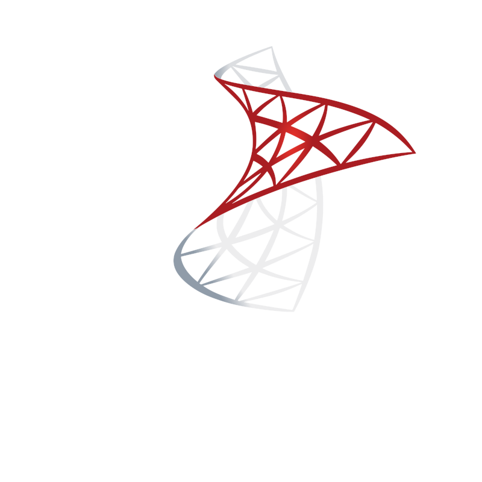

# Hi there, I'm jroelofsz 👋

Welcome to my GitHub profile! I'm passionate about software development with a focus on game modification, web technologies, and database management.

---

## 🛠️ Tech Stack

  
  
  
  
  
  
  
  
  

---

## 🎮 Current Focus

I'm actively working on **FiveM** development, creating custom scripts, resources, and tools for the GTA V multiplayer platform. My work enhances gameplay experiences for communities, with a strong emphasis on quality and collaboration.

---

## 🤝 Open Source & Community

- Proud contributor to [Project Sloth](https://github.com/project-sloth), a community-driven FiveM resource hub.

---

Thanks for stopping by!
